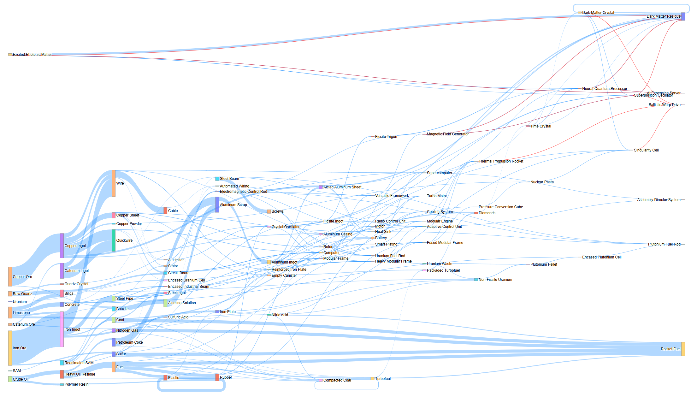

# SatisCal：Satisfactory 回收优化工具  
**SatisCal: Optimization Tool for Recycling in Satisfactory**

SatisCal 是一个用于《Satisfactory》的优化分析工具，  
目标是在给定的资源产出与配方体系下（默认全图所有的资源点，并且全部最高级采矿机 2.5 倍超频），  
通过线性规划模型最大化每分钟的回收点数。适用于希望最大化资源利用效率的后期玩家。  
SatisCal is an optimization and analysis tool for the game *Satisfactory*.  
It maximizes per-minute sink points under a predefined set of production resources and recipes  
(assuming all resource nodes are unlocked and all miners are overclocked to 2.5x),  
using a linear programming model. This tool is designed for late-game players aiming to maximize resource utilization.

---

## 主要功能 | Features

- **建模求解最大化回收点数**  
  自动构建线性规划模型，求解最大回收点配置。  
  *Automatically constructs and solves a linear programming model to find the configuration with maximum sink point output.*

- **支持 Boost 配方（超频+倍增）**  
  支持将部分配方拆为增强版本，加入索莫晶体约束（整数变量）。  
  *Supports boosted recipes with overclocking and enforces Somersloop-based usage limits using integer constraints.*

- **处理不可回收物品**  
  自动对不可回收物品添加“最终产量为 0”的可持续性约束。  
  *Adds sustainability constraints that enforce zero final stock for non-recyclable items.*

- **生成可视化图表与报表**  
  输出交互式 Sankey 图、物品流统计、配方执行数据。  
  *Generates interactive Sankey diagrams, item flow statistics, and recipe execution summaries.*

- **对单独物品进行精确查询**  
  使用 `query_item_usage` 函数分析任意物品的配方与用量路径。  
  *Use the `query_item_usage()` function to trace the production and consumption paths of any item.*

---

## 数学模型 | Mathematical Model

本项目采用线性规划（部分带整数约束）模型描述资源流与点数优化问题。  
The resource flow and sink point maximization problem is formulated as a linear programming model with optional integer constraints.

### 决策变量 | Decision Variables

- \( x_j \in \mathbb{R}_{\geq 0} \)：标准配方 j 的执行频率  
  *Execution rate of standard recipe \( j \)*

- \( z_j \in \mathbb{Z}_{\geq 0} \)：增强版配方 j 的使用次数  
  *Execution count of boosted recipe \( j \), constrained to integers*

### 输入参数 | Parameters

- \( \Delta_{ij}^{(x)} \)：标准配方 j 对物品 i 的净变动量（正为产出，负为消耗）  
  *Net change of item \( i \) caused by standard recipe \( j \) (positive for output, negative for input)*

- \( a_i \)：物品 i 的初始库存  
  *Initial inventory of item \( i \)*

- \( v_i \)：物品 i 的单位回收点数（为 0 表示不可回收）  
  *Sink point value per unit of item \( i \) (0 if non-recyclable)*

### 目标函数 | Objective

最大化最终可回收物品带来的总回收点数：  
Maximize the total sink points derived from the final net output of recyclable items:

\[
\max \sum_i v_i \cdot \left( a_i + \sum_j \Delta_{ij}^{(x)} \cdot x_j + \sum_j \Delta_{ij}^{(z)} \cdot z_j \right)
\]

### 约束条件 | Constraints

1. **资源守恒 | Resource Conservation**

\[
a_i + \sum_j \Delta_{ij}^{(x)} x_j + \sum_j \Delta_{ij}^{(z)} z_j \geq 0 \quad \forall i  
\]
*Ensures no negative stock for any item.*

2. **不可回收物品零库存 | No Final Stock for Unrecyclable Items**

\[
v_i = 0 \Rightarrow a_i + \sum_j \Delta_{ij}^{(x)} x_j + \sum_j \Delta_{ij}^{(z)} z_j = 0  
\]
*Forces all non-recyclable items to have zero net output.*

3. **索莫晶体限制 | Somersloop Usage Limit**

\[
\sum_j \text{oc}_j \cdot z_j \leq \text{Somersloop Budget}  
\]
*Constrains total boosted recipe usage based on available Somersloops.*

4. **变量非负，Boost 配方为整数变量 | Non-negativity and Integrality**

*All decision variables are non-negative; boosted recipe counts are integers.*

---

## 额外参数 | Extra Controls

项目中支持两个辅助限制参数，可修改为自定义情境：  
Two auxiliary constraint parameters allow customization of model behavior:

| 参数名 | 说明 | Description |
|--------|------|-------------|
| `resource_reserve` | 强制保留部分资源（如电力或终端产物）不被消耗。例如默认保留 80000 电力 + 20 个奇点电池 | Forces a fixed reserve of certain resources (e.g., 80,000 power and 20 singularity batteries by default) |
| `resource_maximum` | 限制某些资源（如水）的最大产量，避免过度使用空间密集型资源 | Imposes upper bounds on production of certain space-intensive items (e.g., water) |

---

## 输出内容 | Output Files

运行 `workspace.ipynb` 后将生成以下结果文件：  
Running `workspace.ipynb` generates the following output files:

| 文件 | 内容 | Description |
|------|------|-------------|
| `item_usage.csv` | 每种物品的产量、消耗量、剩余量、回收点贡献等 | Per-item production, consumption, surplus, and sink point contribution |
| `used_recipes.csv` | 实际使用的配方及其输入输出详情与执行频率 | Executed recipes with detailed I/O and usage frequency |
| `sankey_diagram.html` | 可交互 Sankey 图展示物品流动路径（Boost=红，Power=橙，普通=蓝） | Interactive Sankey diagram showing item flows (Boosted = red, Power = orange, Standard = blue) |

---

## 使用方法 | How to Use

1. 修改 `items.py` 中的 `sink_points`, `resource_production`, `recipes` 变量；  
   *Edit `sink_points`, `resource_production`, and `recipes` in `items.py`*

2. 打开 `workspace.ipynb` 并逐格运行；  
   *Open and run the cells in `workspace.ipynb`*

3. 查看输出的 HTML 图表与 CSV 报表；  
   *Check the generated HTML and CSV reports*

4. 若要查询某物品流向或用途，使用 `query_item_usage("ItemName", ...)`。  
   *Use `query_item_usage("ItemName", ...)` to trace usage and production paths.*

也可以直接查看我预先计算的内容。即 `item_usage.csv`, `used_recipes.csv`, 和 `sankey_diagram.html`。前两者可以用 Excel 打开，后者直接用浏览器打开。  
You may also inspect the precomputed results: `item_usage.csv`, `used_recipes.csv`, and `sankey_diagram.html`. The first two open in Excel, the last in any browser.
